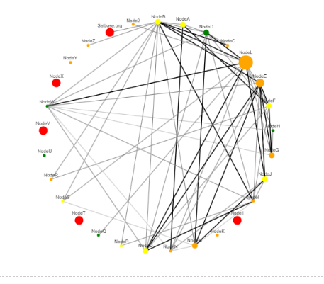

# Network graph for a Bitcoin Lightning Network routing node

To create a network graph based on relative transactional volume and related fees between channels.

Date: 11/02/2023

Fulmine Labs LLC

Under MIT open source license

The problem: It can be hard for Lightning Network node operators to determine which of their channels are performing well (and which may not be) from the raw transactional data provided by interfaces such as Ride the Lightning (RTL).

This Python code aggregates transactions and allows at-a-glance vizualization of where traffic was heavy or light, which channels cluster together and how fees were set relative to other nodes.

The input to this is a Ride the Lightning transaction history CSV file, exported from the RTL routing interface
A sample file, Forwarding-history-sample.csv is provided. The sample data has been anonymized for privacy, but actual RTL data will display actual node names.
Modify the call to load_data(), as needed.

1. Node Creation: Each node represents a channel that has participated in some routing
2. Edge Creation: Each edge between two nodes represents the transactional volume between those two channels, where the thickness or color of the edge represents the normalized transactional volume
3. Node Size: The size of the node indicates the sum of the transactions for that channel
4. Node Color: The node color indicates the average fee for that node:
 *   Red no outbound transactions
 *   Orange lowest fees
 *   Yellow medium fees 
 *   Green highest fees

To achieve this, we used the networkx library, a tool for creating and analyzing networks and the ipycytoscape library to visualize and interact with the networkx graph.
cytoscape allows interactive zoom and the dragging of nodes for improved visualization

This code was run in Jupyter Notebook and Jupyter Lab from Anaconda on Windows. It was written collaboratively with GPT-4V. Thank you Assistant!

To run the code:
1) Install Anaconda
2) Clone the LNRoutingVizualization repository to your local machine and navigate to the cloned directory in Anaconda Powershell Prompt: 'cd LNRoutingVizualization'
3) Install the dependencies listed in requirements.txt with 'pip install -r requirements.txt'
4) Open Jupyter Notebook or Jupyter Lab from Anaconda (see note below for large transaction volumes)
5) Open _LN Routing Node Visualization.ipynb_ from the cloned directory inside Jupyter and 'Run All Cells'

It was tested with over 10,000 transactions. The graph got a little 'dense' (GPT-4V's description), but is definitely still helpful, particularly by taking advantage of cytoscape's interactive capabilties. 

To avoid 'datarate is exceeded' errors in Jupyter, for large numbers of transactions it is recommended to start Jupyter from Anaconda Powershell:
_jupyter notebook --NotebookApp.iopub_data_rate_limit=1.0e10_
or
_jupyter lab --NotebookApp.iopub_data_rate_limit=1.0e10_

If successful the output should look something like this:

