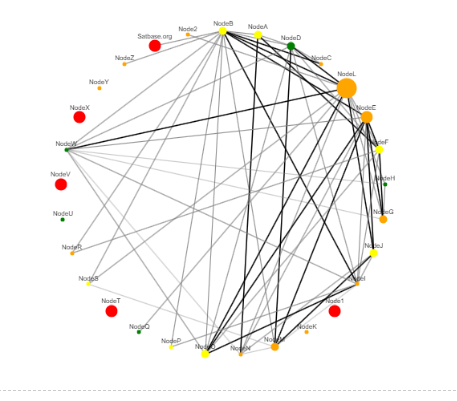
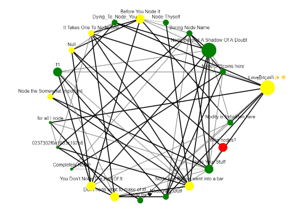

# Network graph for a Bitcoin Lightning Network routing node

To create a network graph based on relative transactional volume and related fees between channels.

Date: 12/01/2023

Fulmine Labs LLC

## Overview

The problem: It can be hard for Lightning Network node operators to determine which of their channels are performing well (and which may not be) from the raw transactional data provided by interfaces such as Ride the Lightning (RTL).

This Python code aggregates transactions and provides an at-a-glance vizualization of where traffic was heavy or light, which channels cluster together and how fees were set relative to other nodes.

The input to this is either:
1) The node transaction history, obtained directly from the node via gRPC
or
2) A transaction history CSV file, exported from the RTL routing interface. 
A sample file, Forwarding-history-sample.csv is provided. The sample data has been anonymized for privacy, but actual RTL data will display actual node names.

1. Node Creation: Each node represents a channel that has participated in some routing
2. Edge Creation: Each edge between two nodes represents the transactional volume between those two channels, where the thickness or color of the edge represents the normalized transactional volume
3. Node Size: The size of the node indicates the sum of the transactions for that channel
4. Node Color: The node color indicates the average fee for that node:
 *   Red no outbound transactions
 *   Orange lowest fees
 *   Yellow medium fees 
 *   Green highest fees

To achieve this, we used the networkx library, a tool for creating and analyzing networks and the ipycytoscape library to visualize and interact with the networkx graph.
cytoscape allows interactive zoom and the dragging of nodes for improved visualization

## Current Version
The current stable version of the project is 1.0.2. See the [CHANGELOG.md](./CHANGELOG.md) for details about this release.

## Prerequisites (General)

* A working Bitcoin Lighning Network routing node, with some active channels - see [RaspiBolt](https://raspibolt.org/) for detailed instructions on how to setup a node running on a Raspberry Pi
* The Ride The Lightning interface to your node
* Anaconda
* The Python libraries listed in requirements.txt

## Prerequisites (RTL)

* The Ride The Lightning interface to your node, which can be downloaded as specified on the Ride-The-Lightning/RTL github repository.
* LND or Eclair backend

## Prerequisites (gRPC)

* Python Version: Ensure that you are using a Python version compatible with LND's gRPC requirements. As of 12/24/2023, Python 3.7 or higher is recommended.
* gRPC Tools: You need the gRPC tools for Python, which can be installed using pip.
* LND backend
* LND Source Code: The Protobuf (*.proto) files are part of the LND source code, which can be cloned from the LND GitHub repository as follows:
 - Clone the LND Repository: Clone the LND GitHub repository to your local machine.
 - git clone https://github.com/lightningnetwork/lnd.git
 - Install gRPC Tools: Install the gRPC tools for Python.
 - pip install grpcio grpcio-tools googleapis-common-protos
 - Navigate to the lnrpc directory in the cloned LND repository.
 - Run the following command to generate Python gRPC code from the .proto files:

``` 
python -m grpc_tools.protoc --proto_path=. --python_out=. --grpc_python_out=. *.proto
```

* Setup Python Environment:

It's recommended to use a virtual environment to avoid conflicts with other Python projects.
Create and activate a virtual environment (optional but recommended):
- `python -m venv lnd-env`
- `lnd-env\Scripts\activate`
Ensure that all necessary Python packages are installed within this environment.
- Copy the generated *_pb2.py and *_pb2_grpc.py files to your project directory.

Compatibility Notes:
Ensure that the Python version used for generating gRPC code matches the version used in your project.
If you encounter version compatibility issues, consider using a Python virtual environment with the specific version required.


## Usage for gRPC

1) Install Anaconda
2) Clone the LNRoutingVizualization repository to your local machine and navigate to the cloned directory in Anaconda Powershell Prompt: 'cd LNRoutingVizualization'
3) Install the dependencies listed in requirements.txt with `'pip install -r requirements.txt'`
4) Setup the cytoscape widget to render correctly in Jupyter: `'jupyter nbextension enable --py --sys-prefix ipycytoscape'`
5) Open Jupyter Notebook or Jupyter Lab from Anaconda (see note below for large transaction volumes)
6) Open _LN Routing Node Visualization.ipynb_ from the cloned directory inside Jupyter
7) Set `data_access_method = "gRPC"`
8) Set your routing node's certificate file path, macaroon file path and server port. For example:
```
    cert_file = r'D:\lnd\node1\tls.cert'
    macaroon_file = r'D:\lnd\node1\data\chain\bitcoin\regtest\admin.macaroon'
    rpcserver = 'localhost:10009'
```
8) Set the path to the Protobuf files `protobuf_file_location = r'D:\lnd\proto\lnd\lnrpc'` and import these modules as needed to interact with LND using gRPC.
10) In Jupyter 'Run All Cells'. 
11) Zoom on the widget with the mousewheel, drag the whole graph or just nodes with left click


## Usage for RTL

1) Install Anaconda
2) Clone the LNRoutingVizualization repository to your local machine and navigate to the cloned directory in Anaconda Powershell Prompt: 'cd LNRoutingVizualization'
3) Install the dependencies listed in requirements.txt with `'pip install -r requirements.txt'`
4) Setup the cytoscape widget to render correctly in Jupyter: `'jupyter nbextension enable --py --sys-prefix ipycytoscape'`
5) Open Jupyter Notebook or Jupyter Lab from Anaconda (see note below for large transaction volumes)
6) Open _LN Routing Node Visualization.ipynb_ from the cloned directory inside Jupyter
7) Set `data_access_method = "RTL"`
8) Use RTL to export transactions into a CSV file and copy it into the same LNRoutingVizualization directory
9) Modify `RTL_file = "Forwarding-history-sample.csv"` location as needed, to point at the RTL transaction file
10) In Jupyter 'Run All Cells'
11) Zoom on the widget with the mousewheel, drag the whole graph or just nodes with left click

## Screenshots

If successful the output should look something like this:




## Testing

This code was run in Jupyter Notebook and Jupyter Lab from Anaconda 2.5.1 on Windows 11. 
The backends tested were LND v0.17.0 and Eclair v0.9.0. RTL was v0.14.1.

It was tested with over 12,000 transactions. The graph gets a little 'dense' (GPT-4V's description), but is definitely still helpful, particularly by taking advantage of cytoscape's interactive capabilties. 

The gRPC version was tested using 24 simulated LND nodes, of which one was a routing node connected to each of the others. A few hundred simulated routing transactions were generated randomly.

The output from this version looked like this:



## Known issues

1) To avoid 'datarate is exceeded' errors in Jupyter, for large numbers of transactions it is recommended to start Jupyter from Anaconda Powershell:
jupyter notebook --NotebookApp.iopub_data_rate_limit=1.0e10_ --NotebookApp.iopub_msg_rate_limit=1.0e10
or
jupyter lab --NotebookApp.iopub_data_rate_limit=1.0e10_ --NotebookApp.iopub_msg_rate_limit=1.0e10

2) If the first transaction happens to include a node who's name is a decimal number, node formatting information may be lost

3) It is not possible to save the cytoscape widget from Python. As a workaround:
* Right click and select 'Create new view for output' for more real estate.
* Windows Key + Shift + S (or other snipping tool) to copy a screenshot to the paste buffer

## Acknowledgements

* This code was written collaboratively with GPT-4V. Thank you Assistant!
* A series of [excellent articles on ipycytoscape](https://joseberlines.medium.com/learning-and-visualising-graphs-with-ipycytoscape-1ca150f24933) by Jose Ferro inspired some styling issue workarounds
* [Ride the Lightning](https://github.com/Ride-The-Lightning/RTL)
* Feedback, suggestions and test data from the Plebnet community on Telegram

## License

[MIT open source license](LICENSE.txt)

## Collaboration

We welcome contributions at all levels of experience, whether it's with code, documentation, tests, bug reports, feature requests, or other forms of feedback. If you're interested in helping improve this tool, here are some ways you can contribute:

- **Ideas for Improvements**: Have an idea that could make the LN Routing Vizualization tool better? Open an issue with the tag `enhancement` to start a discussion about your idea.
- **Bug Reports**: Notice something amiss? Submit a bug report under issues, and be sure to include as much detail as possible to help us understand the problem.
- **Feature Requests**: If you have a suggestion for a new feature, describe it in an issue with the tag `feature request`.
- **Documentation**: Good documentation is just as important as good code. Although this is currently a very simple tool, if you'd like to contribute documentation, we'd greatly appreciate it.
- **Code**: If you're looking to update or write new code, check out the open issues and look for ones tagged with `good first issue` or `help wanted`.

## Contact

Duncan Henderson, Fulmine Labs LLC
henderson.duncanj@gmail.com
